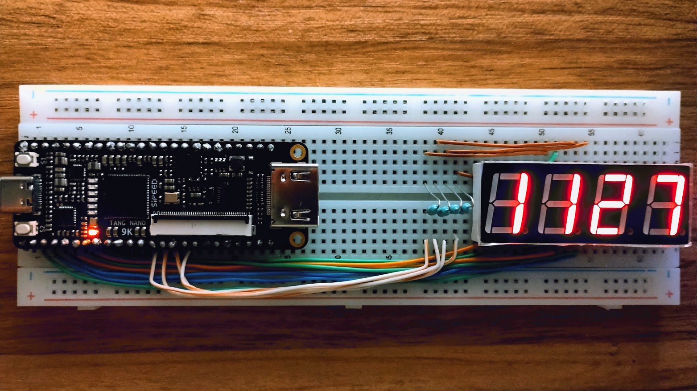

# Cronómetro Digital en FPGA Tang Nano 9k

Cronómetro digital implementado en **VHDL** para la FPGA **Tang Nano 9k**, que muestra minutos y segundos en formato **MMSS** mediante un display de 7 segmentos. Incluye control de parada y reinicio, con multiplexado de display para optimizar el consumo de energía.

---

## Características principales

- Implementación en **VHDL**.
- **Formato de tiempo**: MMSS (minutos y segundos).
- **Reloj de referencia**: cristal de 27 MHz.
- **Multiplexado 4 a 1** para display de cátodo común (40 Hz).
- Límite de conteo: **59:59** → se reinicia a 00:00.
- **Botón de reset** → regresa el cronómetro a cero.
- **Botón de stop** → detiene la cuenta.

---

## Fotos del proyecto

---

## Especificaciones técnicas

- **Lenguaje**: VHDL  
- **Plataforma**: Tang Nano 9k (GW1NR-LV9QN88C6/I5)  
- **Frecuencia del reloj base**: 27 MHz  
- **Frecuencia de multiplexado display**: 40 Hz  
- **Tipo de display**: 4 displays, 7 segmentos, cátodo común  